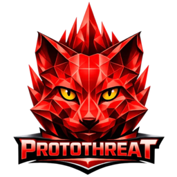

<!--
  SPDX-License-Identifier: AGPL-3.0-only
  Copyright (c) Hafnova AG
-->

<div align="center">



### ProtoThreat · Go client

Official **Go** SDK for talking to a ProtoThreat instance over HTTP: API challenge auth, command dispatch, protobuf types, and small wire helpers.

[](https://go.dev/dl/)
[](LICENSE)
[](https://github.com/protothreat/go)

[**github.com/protothreat/go**](https://github.com/protothreat/go)

</div>

---

## At a glance

| | |
|:---|:---|
| **Module** | `github.com/protothreat/go` |
| **Install** | `go get github.com/protothreat/go@latest` |
| **License** | [AGPL-3.0-only](LICENSE) |

---

## Features

- HTTP command surface with **API challenge** secrets (`id` / `psk` hex) or static API token / basic-style user map.
- **Protobuf** types (`pb`) for payloads such as `Output`; **wire** constants for command names.
- **Utilities** for POSTing commands, parsing ProtoThreat URIs, and IP index buffers used when building commit rows.
- **Blockchain** and **commit** helpers for bootstrap blobs, permission labels, drafts, and storage-size helpers—client-side shaping only; the server remains authoritative for validation and policy.

---

## Requirements

- Go **1.23+** (see `go.mod` in this repository).

---

## Install

Published module:

```bash
go get github.com/protothreat/go@latest
```

Working from a **local checkout** of this tree (replace path with yours):

```bash
go mod edit -replace github.com/protothreat/go=.
```

---

## Package layout

| Path | Role |
|:-----|:-----|
| `client` | `ProtoThreat` HTTP client, connect, `Request` / `Command`, typed convenience methods |
| `challenge` | Build and parse API challenge material (HMAC / plain) |
| `pb` | Generated `threat.proto` messages |
| `wire` | `COMMIT_COMMANDS`, `BLOCKCHAIN_COMMANDS`, `DEBOUNCER_COMMANDS` |
| `utils` | Command POST, URI parsing, bounded decode, IP index helpers |
| `blockchain` | Bootstrap encode/decode, permission strings, storage-size helpers |
| `commit` | Draft row helpers, commit storage size |

---

## Quick start

`APIChallengeSecret` expects the same **id** and **psk** hex strings as an API key on the target ProtoThreat server, issued when the key is created (operator tooling that generates API keys prints them).

```go
package main

import (
	"context"
	"fmt"

	"github.com/protothreat/go/client"
)

func main() {
	ctx := context.Background()
	pt, err := client.NewProtoThreat(client.Options{
		URI: "http://127.0.0.1:8080",
		APIChallengeSecret: map[string]any{"id": "…", "psk": "…"},
	})
	if err != nil {
		panic(err)
	}
	if err := pt.Connect(); err != nil {
		panic(err)
	}
	defer pt.Disconnect()
	out, err := pt.Health(ctx)
	if err != nil {
		panic(err)
	}
	fmt.Println(out)
}
```

---

## Examples

JSON bodies use the field names the server expects (camelCase on nested `input`, e.g. `tagsSet`).

### Commit: draft then threat row

`CommitStoragePut` uses the commit `id` (or `idx`) from `CommitCreate`, a root-level `domain` or `ip` for the row index, and `input` (blockchain `Input` fields: tags, comments, metadata, …).

```go
created, err := pt.CommitCreate(ctx, map[string]any{})
if err != nil {
	panic(err)
}
m := created.(map[string]any)
commitID, _ := m["id"].(string)

_, err = pt.CommitStoragePut(ctx, map[string]any{
	"id": commitID,
	"domain": "malicious.example",
	"input": map[string]any{
		"domain": "malicious.example",
		"tagsSet": []any{"feed-acme", "suspicious"},
	},
})
```

### Debouncer

An **admin** creates the instance with `DebouncerCreate` (`ownerUserId`, `z`, `ttlSec`, `targets` as `commit` / `chain`, plus `commitIdx` or `chainIds` when required). Non-owners need `DebouncerPermGrant`. `DebouncerEnqueue` takes the debouncer `id` and the same root `domain`/`ip` + `input` pattern as `CommitStoragePut`.

```go
_, err = pt.DebouncerEnqueue(ctx, map[string]any{
	"id": debouncerID,
	"domain": "volatile.example",
	"input": map[string]any{
		"domain": "volatile.example",
		"tagsSet": []any{"seen"},
	},
})
```

### Blockchain: read and select locally

Use a **full-chain** peer. Resolve a chain `id` (64 hex chars) from `BlockchainList` or `BlockchainListPublic`. Call `BlockchainBlocksPage` with `id`, `limit`, optional `cursor` (`nextCursor` from the last page), and optional `maxOutputs`. Filter client-side: decode each element of `block.outputs` from hex with `proto.Unmarshal` into `threatpb.Output`, then keep rows that match your rules.

```go
import (
	"encoding/hex"
	threatpb "github.com/protothreat/go/pb"
	"google.golang.org/protobuf/proto"
)

page, err := pt.BlockchainBlocksPage(ctx, map[string]any{
	"id": chainIDHex64, "limit": 20, "maxOutputs": 64,
})
// page map: "blocks" ([]any of block maps), "nextCursor"; decode each output hex with hex.DecodeString + proto.Unmarshal into threatpb.Output
```

---

<div align="center">

<sub>ProtoThreat is a product line of Hafnova AG · <a href="LICENSE">License</a></sub>

</div>
